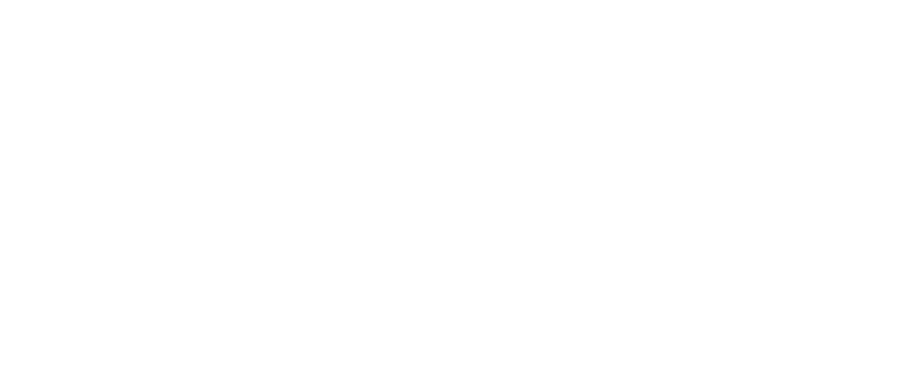

<div align="center">
  

  # Pixl

  **Models are not the product. Systems are.**

  [Website](https://pixldev.be) · [Feen](https://feen.be) · [Blog](https://pixldev.be/blog) · [Contact](mailto:hello@pixldev.be)
</div>

---

Landing site and blog for Pixl, a Belgian AI studio building interconnected business tools for SMEs, freelancers, and accountants.

## Products

| Product | Status | Description |
|---------|--------|-------------|
| **Feen** | 🟢 Live | Financial intelligence & invoicing (Peppol-ready) |
| **Company Data** | 🟢 Live | Belgian company intelligence — free lookup + API |
| **Bumpi** | 🟡 Private beta | Brand-locked AI content studio |
| **Syncco** | 🟡 Coming soon | Compliance monitoring (BCE/KBO ↔ Moniteur Belge) |
| **Pixl Web** | ⚪ Planned | AI website builder |
| **Pixl Branding** | ⚪ Planned | Brand book studio |

Statuses are kept honest: live, coming soon, or planned.

## Blog

Trilingual (EN/FR/NL) posts live in `content/blog/<slug>/{en,fr,nl}.md`. A build step
(`npm run blog:build`, auto-run before dev/build) compiles them into
`lib/blog-data.generated.ts`. RSS at `/feed.xml`.

## Tech Stack

- **Framework:** Next.js 16, React 19
- **UI:** Tailwind CSS + shadcn/ui, Linear-inspired dark theme
- **i18n:** EN / FR / NL (client-side switching)
- **SEO:** per-page metadata, JSON-LD (Organization, BlogPosting, Breadcrumb), dynamic OG images at `/og`, sitemap, llms.txt
- **Deployment:** Netlify

## Development

```bash
npm install
npm run dev
```

## License

© Pixl SRL. All rights reserved.

---

<div align="center">
  <sub>Built with ❤️ in Belgium</sub>
</div>
